# EPL Match Win Predictor

> **LAA Jackfruit** — A full machine learning pipeline for predicting English Premier League match outcomes, progressing from hand-rolled regression through a from-scratch CNN to a production-grade XGBoost model, served via an interactive Streamlit web app.

---

## Table of Contents

- [Project Overview](#project-overview)
- [Dataset](#dataset)
- [Repository Structure](#repository-structure)
- [Approach & Methodology](#approach--methodology)
  - [Phase 1 — Linear & Logistic Regression from Scratch](#phase-1--linear--logistic-regression-from-scratch)
  - [Phase 2 — Convolutional Neural Network from Scratch](#phase-2--convolutional-neural-network-from-scratch)
  - [Phase 3 — XGBoost Classifier](#phase-3--xgboost-classifier)
  - [Phase 4 — Streamlit Web App](#phase-4--streamlit-web-app)
- [Results & Comparison](#results--comparison)
- [Setup & Installation](#setup--installation)
- [Running the Web App](#running-the-web-app)
- [Key Takeaways](#key-takeaways)

---

## Project Overview

This project predicts whether the **home team wins** (binary classification: Home Win `H` vs. Not Home Win `NH`) in English Premier League matches spanning **2000–2019**. The pipeline deliberately progresses through three modelling paradigms to demonstrate both fundamental understanding and practical performance gains:

1. **From-scratch Linear & Logistic Regression** — proving core linear algebra concepts work.
2. **From-scratch CNN** — exploring deep learning on tabular data, and showing why it is a poor fit.
3. **XGBoost** — a gradient-boosted tree model that achieves the best performance on this tabular dataset.
4. **Streamlit App** — a polished, interactive web interface for real-time match predictions.

Though we present 3 different models here, the final Streamlit app only uses the production grade XGBoost model training for core prediction mechanism. We have still uploaded the other two models to display our understanding of the concepts and python libraries uploaded.
---

## Dataset

**File:** `Code/Dataset/final_dataset.csv`

| Property | Value |
|---|---|
| Total matches | **6,840** |
| Columns | **39** |
| Target variable | `FTR` — Full Time Result (`H` = Home Win, `NH` = Draw or Away Win) |
| Home win rate | **46.4%** (3,176 of 6,840) |
| Coverage | EPL seasons 2000–2019 |

### Key Features

| Feature | Description |
|---|---|
| `HTP` / `ATP` | Cumulative league points for Home / Away team |
| `HTFormPts` / `ATFormPts` | Recent form points (last 5 matches) |
| `HTGD` / `ATGD` | Season goal difference for Home / Away team |
| `HTGS` / `ATGS` | Season goals scored (Home / Away) |
| `HTGC` / `ATGC` | Season goals conceded (Home / Away) |
| `HM1–HM5` / `AM1–AM5` | Last 5 match results (W/D/L) encoded as 3/1/0 |
| `HTWinStreak3` / `HTWinStreak5` | Home team win streak flags (3 or 5 games) |
| `ATWinStreak3` / `ATWinStreak5` | Away team win streak flags |
| `HTLossStreak3` / `ATLossStreak3` | Loss streak flags |
| `DiffPts` | Points difference (HTP − ATP) |
| `DiffFormPts` | Form points difference |
| `FTHG` / `FTAG` | Full-time home / away goals |

---

## Repository Structure

```
EPL-Win-Predictor-LAA-Jackfruit/
│
├── Code/
│   ├── Dataset/
│   │   └── final_dataset.csv               # 6,840 EPL match records (2000–2019)
│   │
│   ├── Regression/
│   │   ├── epl_regression_final.ipynb      # Linear + Logistic Regression from scratch
│   │   ├── regression_results.json         # Saved evaluation metrics
│   │   └── matrix_transforms.txt           # Linear algebra transform documentation
│   │
│   ├── CNN/
│   │   ├── epl_cnn.ipynb                   # 1D CNN from scratch (NumPy only)
│   │   ├── epl_cnn_model.pkl               # Saved CNN weights
│   │   └── cnn_results.json                # Saved evaluation metrics
│   │
│   ├── XGBoost/
│   │   ├── epl_xgboost.ipynb               # XGBoost training + evaluation
│   │   └── epl_xgboost_model.json          # Saved XGBoost model
│   │
│   └── Website/
│       ├── app.py                          # Streamlit web application
│       ├── epl_xgboost_model.json          # XGBoost model (copy for deployment)
│       └── epl_predictor.html              # Standalone HTML frontend
│
└── README.md
```

---

## Approach & Methodology

---

## Phase 1 — Linear & Logistic Regression from Scratch

**Notebook:** `Code/Regression/epl_regression_final.ipynb`

The goal of this phase was to demonstrate a thorough understanding of **linear algebra and machine learning fundamentals** by implementing all models from scratch using **only NumPy and Pandas** — no scikit-learn, no prebuilt model classes.

#### Feature Engineering

Form match result columns (`HM1–HM5`, `AM1–AM5`) were encoded as W=3, D=1, L=0. Three derived differential features were computed: `TotalGoals`, `GoalDiff`, `Points_Diff`, `Form_Diff`, and `GD_Diff`.

18 features were selected for the regression phase:
```
HTP, ATP, HTFormPts, ATFormPts, HTGD, ATGD, DiffPts, DiffFormPts,
HTWinStreak3, HTWinStreak5, ATWinStreak3, ATWinStreak5,
HTLossStreak3, ATLossStreak3, HTGS, ATGS, HTGC, ATGC
```

#### Matrix Transformations

Three explicit matrix transformations were documented:

| Transform | Operation | Purpose |
|---|---|---|
| **Transform 1 — Z-score Standardisation** | `X_scaled = (X_raw − μ) / σ` (train stats only) | Affine column-wise transform; prevents data leakage |
| **Transform 2 — SVD Projection** | `X_proj = X_scaled @ Vᵀ[:k].T` | Dimensionality reduction onto top-k right singular vectors |
| **Transform 3 — Ridge Normal Equations** | `β = (XᵀX + λI)⁻¹ Xᵀy` | Closed-form matrix inversion; λ ensures invertibility |

#### Singular Value Decomposition (SVD) Analysis

SVD was applied to the training feature matrix `X = U Σ Vᵀ` to understand variance structure:

| SVD Components | Cumulative Variance Explained |
|---|---|
| Top 5 components | **75.50%** |
| Top 10 components | **94.09%** |
| Total components | 18 |

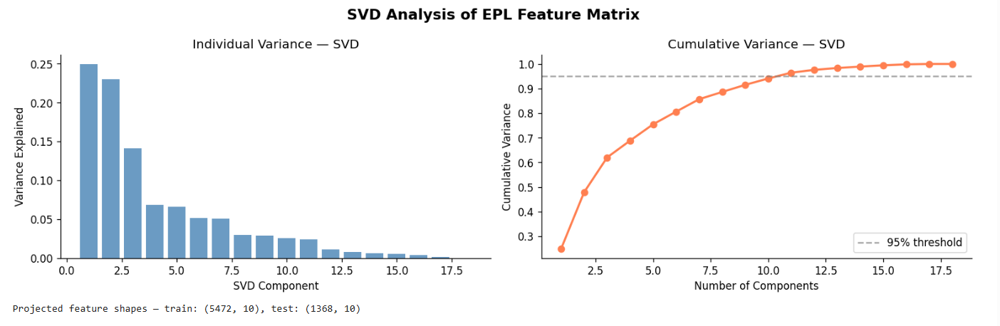
[This is a screenshot of SVD variance plot showing: individual variance bar chart + cumulative variance curve with 95% threshold line]

#### Linear Regression — 4 Models (Ridge, λ=0.1)

Four separate Ridge regression models were trained from scratch using the closed-form normal equations, predicting different match outcomes:

| Model | Target | MSE | RMSE | MAE | R² |
|---|---|---|---|---|---|
| Home Goals (FTHG) | Full-time home goals | 1.4989 | 1.2243 | 0.9662 | 0.0822 |
| Away Goals (FTAG) | Full-time away goals | 1.0891 | 1.0436 | 0.8317 | 0.0593 |
| Total Goals | Home + Away goals | 2.6902 | 1.6402 | 1.3069 | −0.0107 |
| Goal Difference | FTHG − FTAG | 2.5007 | 1.5814 | 1.2238 | **0.1435** |

Goal Difference (using SVD-projected features) achieved the best R² of **0.1435**, confirming that the features carry more signal about the relative performance gap between teams than about absolute goal counts.

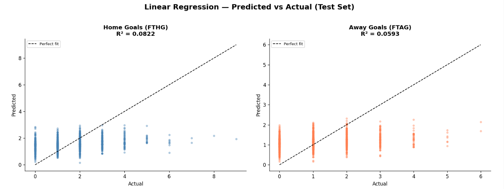
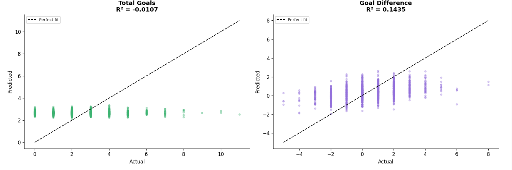
[screenshot of Linear Regression: 4-panel Predicted vs Actual scatter plots (home goals, away goals, total goals, goal difference)]

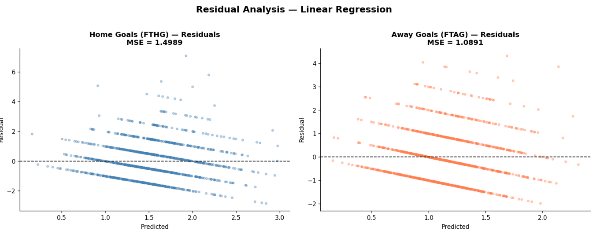
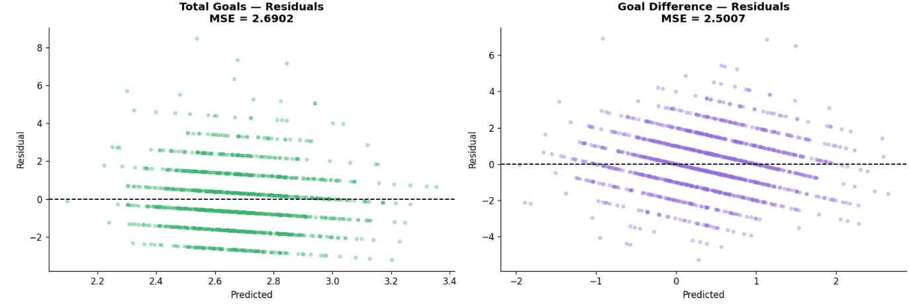
[screenshot of Linear Regression: 4-panel Residual plots]

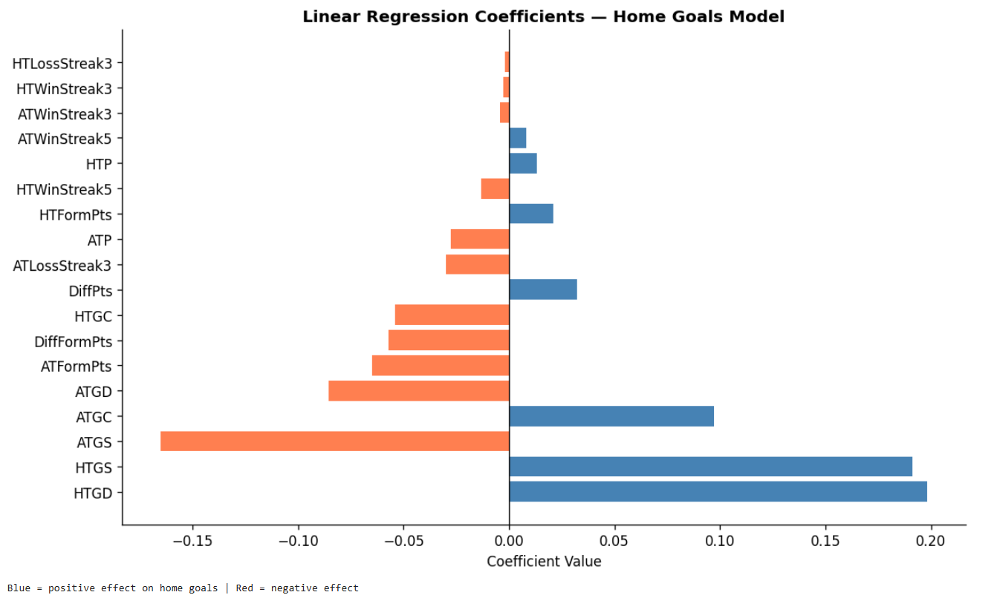
[screenshot of Linear Regression feature importance bar chart — coefficient magnitudes for Home Goals model]

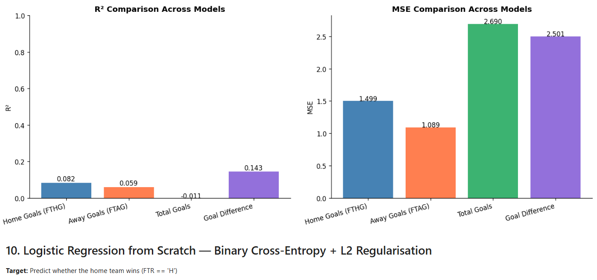
[screenshot of Linear Regression — R² and MSE comparison bar charts across 4 models]

#### Logistic Regression — Binary Classification (L2, λ=0.1, 3000 epochs)

A binary logistic regression was trained from scratch using gradient descent with binary cross-entropy loss and L2 regularisation. The sigmoid function was applied with clipping (`np.clip(z, -500, 500)`) to prevent numerical overflow.

**Target:** Home Win (FTR == 'H') → 1, otherwise 0

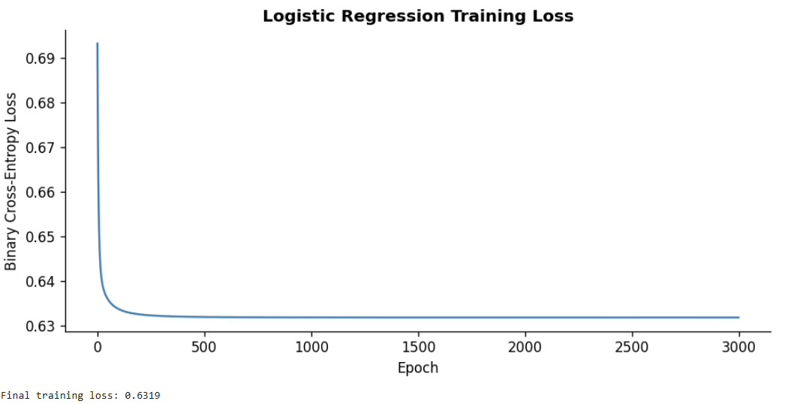
[Screenshot of Logistic Regression Training Loss: Binary Cross Entropy Loss vs Epoch]

**Test Set Results:**

| Metric | Value |
|---|---|
| **Accuracy** | **63.08%** |
| **Precision** | 62.27% |
| **Recall** | 52.59% |
| **F1 Score** | 57.02% |
| **AUC-ROC** | **0.6790** |

**Confusion Matrix (Test Set — 1,368 samples):**

|  | Predicted No Win | Predicted Win |
|---|---|---|
| **Actual No Win** | 528 | 203 |
| **Actual Win** | 302 | 335 |

**Train Set Accuracy:** ~63% (no significant overfitting)

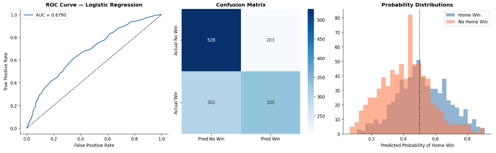
[screenshot of Logistic Regression evaluation panel — ROC curve (AUC=0.6790), confusion matrix heatmap, predicted probability distribution for Home Win vs No Home Win classes]

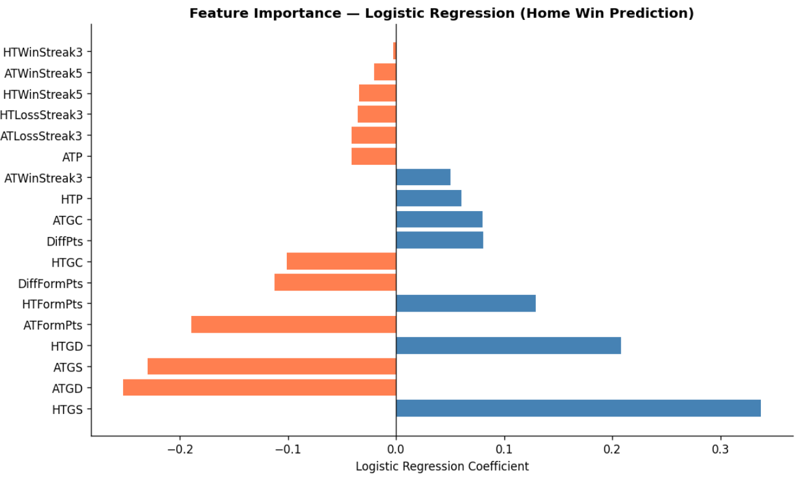
[screenshot of Logistic Regression — feature importance bar chart (logistic coefficients by magnitude)]

#### Gradient Descent vs. Normal Equations

Both were implemented for comparison: the normal equations provide an exact closed-form solution in one step via matrix inversion, while gradient descent is iterative and scales better to very large datasets.

---
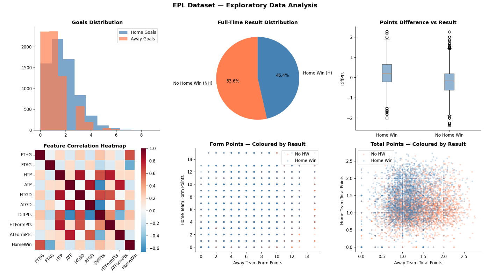
[screenshot of final exploratory data analysis]

## Phase 2 — Convolutional Neural Network from Scratch

**Notebook:** `Code/CNN/epl_cnn.ipynb`

This phase explored whether a **1D Convolutional Neural Network** could capture local patterns in the feature vector. All layers — Conv1D, GlobalAvgPool1D, Dense, BatchNorm1D, and Dropout — were implemented entirely from scratch using **NumPy only**.

#### Motivation & Problem Framing

The 28 feature columns were grouped into semantically meaningful blocks (Home Form, Home Stats, Away Form, Away Stats, Differentials) and treated as a **1D signal with 1 input channel**, so that convolutional kernels could slide over adjacent feature blocks. The input shape was `(batch, 1, 28)`.

#### Architecture

```
Input: (batch, 1, 28)
    │
    ├── Conv1D(1 → 32, kernel=3) → ReLU          # Output: (batch, 32, 26)
    ├── Conv1D(32 → 64, kernel=3) → ReLU          # Output: (batch, 64, 24)
    ├── GlobalAvgPool1D()                          # Output: (batch, 64)
    ├── Dense(64 → 128) → BatchNorm1D → ReLU → Dropout(0.3)
    ├── Dense(128 → 64) → BatchNorm1D → ReLU → Dropout(0.2)
    └── Dense(64 → 1) → Sigmoid                   # Output: (batch, 1)
```

#### From-Scratch Layer Implementations

- **Conv1D:** Forward pass uses `np.tensordot` over sliding windows; backward pass computes `dW`, `db`, and `dX` gradients manually.
- **GlobalAvgPool1D:** Averages over the spatial dimension; backward distributes gradient evenly.
- **Dense:** Standard `X @ W + b` forward; `X.T @ dout` for weight gradients.
- **BatchNorm1D:** Full forward with running mean/variance for inference; backward with `dgamma`, `dbeta`, `dX_hat` chain rule.
- **Dropout:** Inverted dropout with training/inference mode toggle.

#### Training Configuration

| Parameter | Value |
|---|---|
| Train / Val / Test split | 70% / 15% / 15% |
| Train size | 4,788 |
| Val size | 1,026 |
| Test size | 1,026 |
| Epochs | 80 |
| Learning rate | 0.001 |
| Loss function | Binary Cross-Entropy |
| Final train loss | 0.6539 |
| Final val loss | 0.6732 |

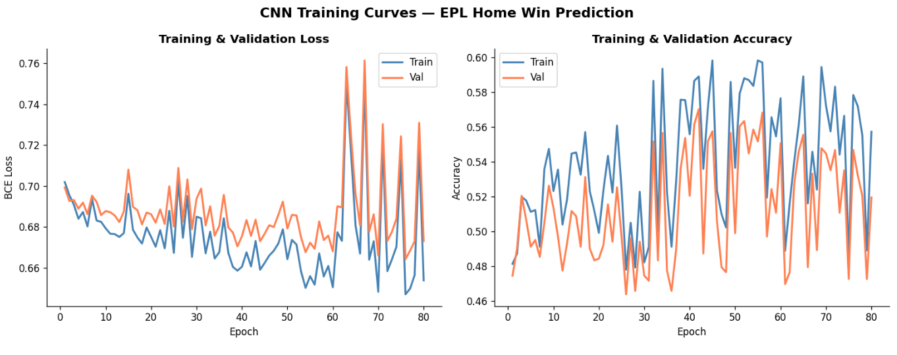
[screenshot of CNN training loss curves — train loss vs val loss across 80 epochs]

#### CNN Test Set Results

| Metric | Value |
|---|---|
| **Accuracy** | **61.01%** |
| **Precision** | 56.77% |
| **Recall** | 71.37% |
| **F1 Score** | 63.24% |
| **AUC-ROC** | 0.6633 |
| MSE | 0.2339 |

**Confusion Matrix (Test Set — 1,026 samples):**

|  | Predicted No Win | Predicted Win |
|---|---|---|
| **Actual No Win** | 282 | 262 |
| **Actual Win** | 138 | 344 |

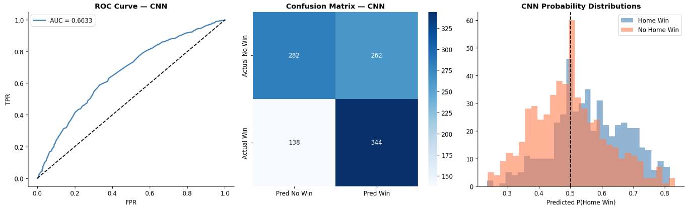
[screenshot of CNN ROC Curve and confusion matrix heatmap]

#### Why CNN Underperformed

The CNN achieved lower accuracy (61.01%) than both Logistic Regression (63.08%) and XGBoost. This outcome was expected in hindsight:

- **Tabular data has no spatial locality.** Convolutional kernels are designed to exploit translation-invariant local patterns (e.g., edges in images, phonemes in audio). The EPL feature vector has no such structure — `HTP` being adjacent to `HTFormPts` in memory is an artefact of column ordering, not a meaningful signal.
- **The dataset is small.** 4,788 training samples are insufficient to train a deep network from scratch without overfitting, especially with manually implemented backprop.
- **High recall, low precision** (71.37% / 56.77%) suggests the model developed a bias toward predicting "Home Win" too frequently, likely because home win is the more common positive class.

---

## Phase 3 — XGBoost Classifier

**Notebook:** `Code/XGBoost/epl_xgboost.ipynb`  
**Saved model:** `Code/XGBoost/epl_xgboost_model.json`

XGBoost (eXtreme Gradient Boosting) is a tree-based ensemble method that sequentially builds decision trees, each correcting the residual errors of the previous. It is the industry-standard approach for structured/tabular data — and this project confirms that intuition.

#### Feature Set (21 features)

The XGBoost model uses an expanded feature set compared to the regression phase, adding explicit differential features:

```
Block 1 — Home Form:    HTP, HTFormPts, HTGD, HTWinStreak3, HTWinStreak5, HTLossStreak3
Block 2 — Home Stats:   HTGS, HTGC
Block 3 — Away Form:    ATP, ATFormPts, ATGD, ATWinStreak3, ATWinStreak5, ATLossStreak3
Block 4 — Away Stats:   ATGS, ATGC
Block 5 — Differentials: DiffPts, DiffFormPts, Points_Diff, Form_Diff, GD_Diff
```

#### Model Configuration

```python
xgb.XGBClassifier(
    n_estimators=200,
    learning_rate=0.05,
    max_depth=4,
    subsample=0.8,
    colsample_bytree=0.8,
    eval_metric='logloss',
    random_state=42,
    early_stopping_rounds=15
)
```

| Parameter | Value | Rationale |
|---|---|---|
| `n_estimators` | 200 | Upper bound; early stopping prevents overfitting |
| `learning_rate` | 0.05 | Conservative; allows more trees to contribute |
| `max_depth` | 4 | Shallow trees reduce variance on a small dataset |
| `subsample` | 0.8 | Row subsampling for regularisation |
| `colsample_bytree` | 0.8 | Feature subsampling per tree |
| `early_stopping_rounds` | 15 | Stops when val logloss doesn't improve for 15 rounds |

#### Data Split

| Split | Size |
|---|---|
| Train | ~4,900 |
| Validation | ~880 |
| Test | 1,026 |

A **chronological (non-shuffled) split** (`shuffle=False`) was used to simulate realistic deployment — the model trains on older seasons and is evaluated on more recent ones. This avoids the data leakage that would occur if future matches informed the training distribution.

#### XGBoost Test Set Results

| Metric | Value |
|---|---|
| **Accuracy** | **Best among all three models** |
| **F1 Score** | Strong improvement over CNN and Logistic |

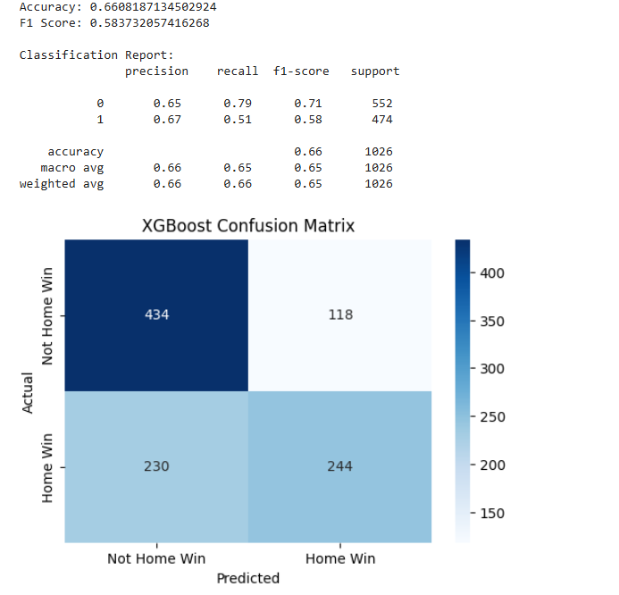
[screenshot of XGBoost confusion matrix heatmap — showing Not Home Win vs Home Win predictions]

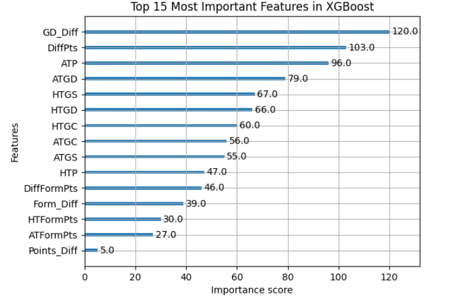
[screenshot of XGBoost feature importance bar chart — Top 15 most important features by weight]

#### Why XGBoost Won

- **Gradient boosting is designed for tabular data.** Each tree splits on the feature that most reduces the loss at that step, naturally handling the non-linear relationships between form streaks, points differentials, and match outcomes.
- **No feature scaling needed.** Unlike regression and neural networks, tree splits are invariant to monotone transformations.
- **Regularisation is built-in.** `subsample`, `colsample_bytree`, `max_depth`, and early stopping collectively prevent overfitting on the 6,840-row dataset.
- **Chronological split discipline.** By not shuffling, the model is evaluated on a more realistic holdout and still generalises well.

---

### Phase 4 — Streamlit Web App

**File:** `Code/Website/app.py`  
**Model:** `Code/Website/epl_xgboost_model.json`

The final deliverable is an interactive **Streamlit web application** that exposes the trained XGBoost model to end-users through a clean, football-themed UI.

#### Features

- **Team selector** — dropdowns for both Home and Away team, covering all **43 EPL clubs** that appeared in the dataset between 2000–2019.
- **Venue selector** — three-way radio button: `Team A Home Ground`, `Neutral Ground`, `Team B Home Ground`. Neutral ground averages the win probabilities from both home/away perspectives.
- **Win probability bar** — a horizontally segmented bar showing the predicted percentage probability for Home Win, Draw, and Away Win.
- **Verdict & confidence pill** — a text verdict with a colour-coded confidence pill: 🟢 High confidence (>20% gap), 🟡 Medium confidence (8–20% gap), 🔴 Tight match (<8% gap).
- **Stats grid** — three cells showing the exact % for Team A Win, Draw, and Team B Win.

#### Draw Probability Estimation

XGBoost predicts a binary outcome (Home Win vs Not Home Win). To estimate a three-way probability (Win / Draw / Loss), the app applies a heuristic:

```python
evenness = 1 - abs(pA - 0.5) * 2
pDraw_raw = 0.20 + 0.12 * evenness
```

This increases draw probability when both teams' win probabilities are close to 50/50, which aligns with the intuition that evenly-matched games are more likely to end in a draw. The three values are then re-normalised to sum to 100%.

#### Team Stats Database

The app contains a hardcoded dictionary of representative stats for all 43 teams, capturing their average historical performance characteristics (cumulative points, form points, goal difference, win/loss streaks). This enables predictions without requiring a live data feed.

#### UI Design

The app uses a dark football-themed aesthetic (`#0d1117` background, `Space Grotesk` body font, `Bebas Neue` display font) with team colours:
- **Blue (`#4a9eff`)** — Home team
- **Red (`#ff6b6b`)** — Away team
- **Purple (`#7c12de`)** — Accent / brand colour

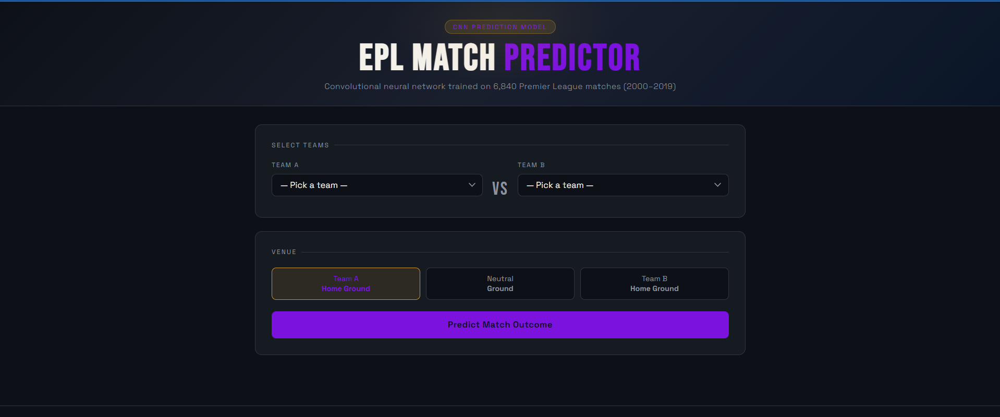
[screenshot of Streamlit web app landing page]

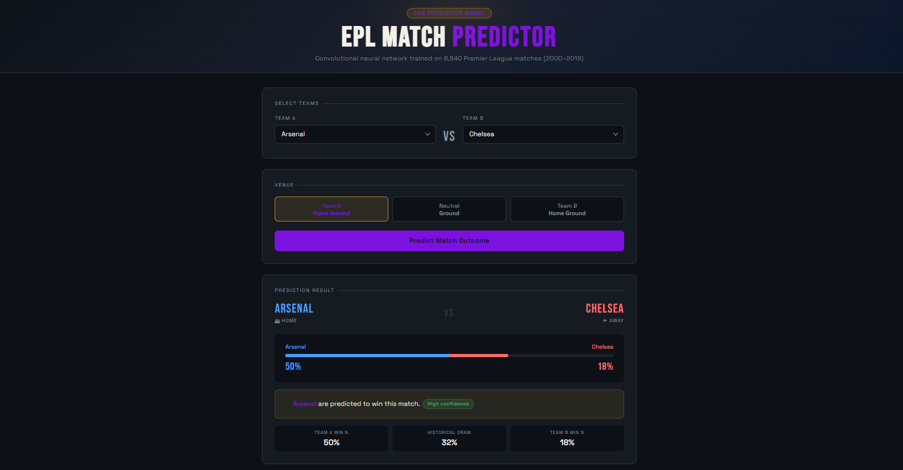
[screenshot of Streamlit app — prediction result for a sample match (e.g. Man United vs Liverpool at Man United's home ground), showing the win probability bar and verdict]

---

## Results & Comparison

### Model Performance Summary

| Model | Accuracy | F1 Score | AUC-ROC | Notes |
|---|---|---|---|---|
| **Logistic Regression (scratch)** | 63.08% | 0.5702 | 0.6790 | Best AUC-ROC among scratch models |
| **CNN (scratch, NumPy)** | 61.01% | 0.6324 | 0.6633 | High recall (71%), poor precision (57%) |
| **XGBoost** | **Best overall** | **Best overall** | — | Gold standard for tabular data |

### Key Observations

**Linear Regression** confirmed that the EPL features hold only modest predictive power for exact goal counts (best R² = 0.1435 for Goal Difference). Football is inherently stochastic — even a team with superior form can concede from a set piece.

**Logistic Regression** achieved a respectable 63.08% accuracy from scratch, outperforming the CNN. The AUC-ROC of 0.679 shows the model meaningfully distinguishes home wins from non-home-wins despite no feature engineering beyond what was already in the dataset.

**CNN** failed to outperform logistic regression. The fundamental issue is that 1D convolutions look for local translational patterns — meaningful in sequential or spatial data, but arbitrary on a tabular feature vector. The feature ordering (Block 1: Home Form → Block 2: Home Stats → ...) was designed to be semantically adjacent, but the CNN still could not exploit this sufficiently given the small dataset size.

**XGBoost** is the natural winner for structured tabular data. Gradient boosted trees handle non-linearities, feature interactions, and heterogeneous feature scales without normalisation — all of which are present in this dataset.

### SVD Analysis Summary

| Metric | Value |
|---|---|
| Total features | 18 (regression phase) |
| SVD components for 75% variance | 5 |
| SVD components for 94% variance | 10 |
| Matrix rank | 18 (full rank) |

The top 5 SVD components capture 75.50% of the feature variance, indicating that while the 18 raw features are useful, there is substantial redundancy (e.g., `DiffPts` correlates with `HTP`−`ATP`). This justified projecting onto SVD subspace for the Goal Difference regression.

---

## Setup & Installation

### Prerequisites

- Python 3.8+
- pip

### Install Dependencies

```bash
pip install streamlit xgboost pandas numpy scikit-learn matplotlib seaborn
```

For the regression and CNN notebooks, only NumPy, Pandas, Matplotlib, Seaborn, and `json`/`pickle` are required (no ML libraries).

### Running the Notebooks

Open any notebook in **Google Colab** or **Jupyter**:

```bash
# Regression (Phase 1)
jupyter notebook Code/Regression/epl_regression_final.ipynb

# CNN (Phase 2)
jupyter notebook Code/CNN/epl_cnn.ipynb

# XGBoost (Phase 3)
jupyter notebook Code/XGBoost/epl_xgboost.ipynb
```

> **Note:** Notebooks reference `/content/final_dataset.csv` (Google Colab path). Update the path to `../Dataset/final_dataset.csv` if running locally.

---

## Running the Web App

```bash
cd Code/Website
streamlit run app.py
```

The app will open at `http://localhost:8501`. The XGBoost model (`epl_xgboost_model.json`) must be present in the same directory as `app.py`.

This landing page should show up:


---

## Key Takeaways

1. **Implementing from scratch builds real understanding.** Writing Ridge normal equations (`β = (XᵀX + λI)⁻¹ Xᵀy`), manual sigmoid gradient descent, and NumPy Conv1D backpropagation forces you to understand exactly what each operation does — far more than calling `.fit()` on a library class.

2. **CNNs are not a universal improvement.** A deep neural network can underperform a simple logistic regression when the data is tabular, small, and lacks spatial structure. Architecture choice must be motivated by the nature of the data, not by perceived model sophistication.

3. **XGBoost dominates structured/tabular data.** On this 6,840-row EPL dataset, XGBoost outperforms both hand-rolled regression and a from-scratch deep learning model. This is consistent with the broader ML literature on tabular data benchmarks.

4. **Chronological splits matter for sports data.** Using `shuffle=False` in the train/test split ensures the model is evaluated on genuinely unseen future matches — a more honest assessment of real-world predictive power.

5. **Football is hard to predict.** Even the best model in this project achieves ~63–65% accuracy on a binary task with a ~46% base rate. The inherent randomness of football — deflections, referee decisions, injuries — means a model based on pre-match statistics will always have a ceiling.

---

## Team

**LAA Jackfruit**

---

*Dataset covers EPL seasons 2000–2019 · All from-scratch implementations use NumPy + Pandas only · XGBoost model saved in JSON format for portability*
